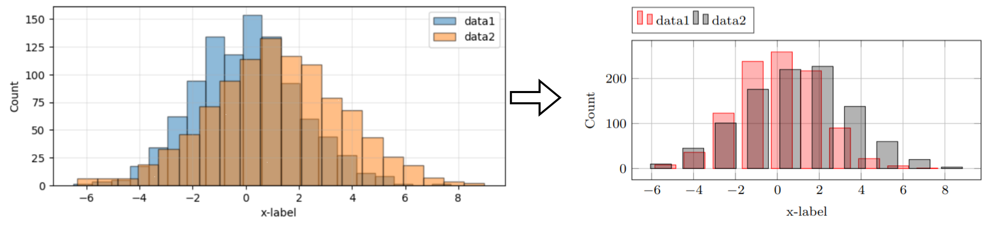
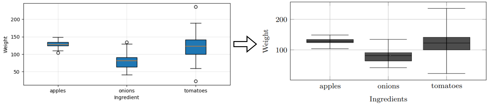
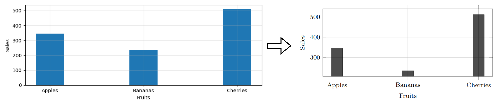
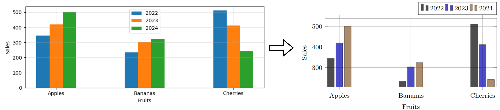
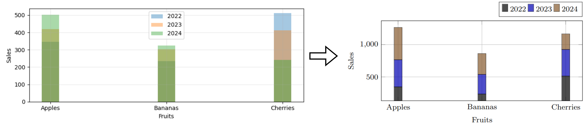
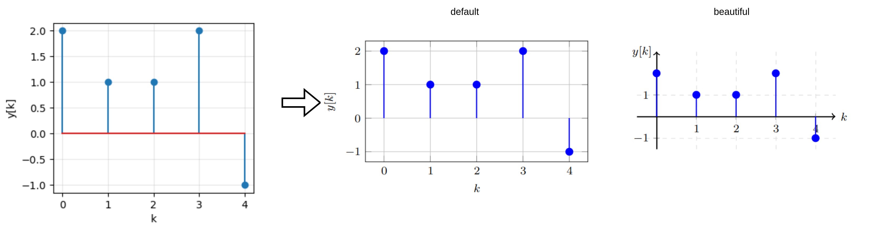

# $\text{plot}\LaTeX$

The `plotLaTeX` package is a recent project to make exporting Python data to a LaTex plot easier.

## Examples

**[Line](examples/LinePlot.ipynb)**

<p align="center">
    
</p>

**[Histogram](examples/HistPlot.ipynb)**

<p align="center">
    
</p>

**[Boxplot](examples/BoxPlot.ipynb)**

<p align="center">
    
</p>

**[Barplot](examples/BarPlot.ipynb)**

<p align="center">
    
</p>
<p align="center">
    
</p>
<p align="center">
    
</p>

**[Stemplot](examples/StemPlot.ipynb)**

<p align="center">
    
</p>


**TBD**

- 3D scatter
- Poles Zeros plot

## Installation

At the moment, no [pip](https://pypi.org/) release is available. Probably in the future...

To use the package

1. **Clone the repository**  
   Open a terminal or command prompt and clone the repository using the following command:
   ```bash
   git clone https://github.com/JacobTh98/plotLaTeX.git

2. **Navigate to the directory**  
   Change into the directory of the cloned repository:
   ```bash
   cd plotLaTeX

3. **Install dependencies**
   ```bash
   pip install -r requirements.txt

4. **Install the package locally**  
   Install the Python package in editable mode using the following command:
   ```bash
   pip install -e .

## Call for Collaboration

I welcome all ideas and new pull requests.
If you have any ideas or problems, don't hesitate to contact me.

Email: `jacob.thoenes@uni-rostock.de`

